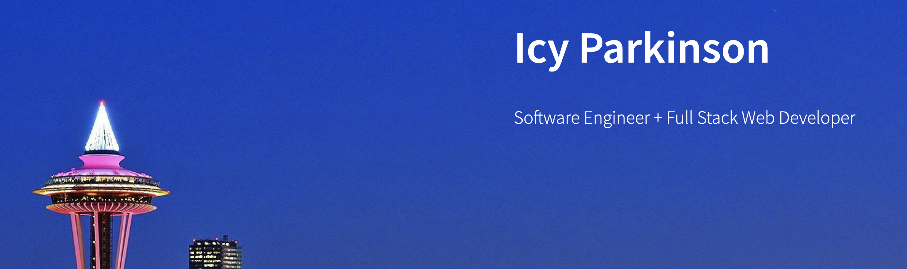

  
  
  <h2>Overview</h2>
  
  Hi there! Thanks for making your way to this readme. I built this portfolio from scratch and it's forever getting updated and tweaked. I try to improve it as much as I can and whenever I think of possible improvements. I hope you enjoy your time browsing and learning more about me!
  
  <h2>Features</h2>
 
  Feel free to use the links on the top right corner of the site to quickly navigate to different sections of the page. I made this website to act as my portfolio to display my work. As I make more interesting projects, I'll include them here so please check back again later to find more! There's also a contact section so that you can reach out to me in case you have any questions or would like to connect. I'm always happy to meet and talk to someone new. 
  
  <h2>Some Things I learned Making This Portfolio</h2>
  
  <ul>
    <li>Using smooth scrolling to move between different page anchors</li>
    <li>How to use JavaScript to loop through links to display text decoration (underline)</li>
    <li>How to make a navigation menu appear for smaller screen sizes</li>
    <li>Utilizing gifs in place of images for projects</li>
    <li>How to use CSS to change appearance of elements on hover</li>
   </ul>

<h2>Want More?</h2>
If you'd like to see more about me, please visit my <a href="https://www.linkedin.com/in/icyparkinson/">LinkedIn</a>.

If you haven't given it a look yet, check out my <a href="https://pikaclicker.netlify.app/">Pikachu Clicker</a>!
    
